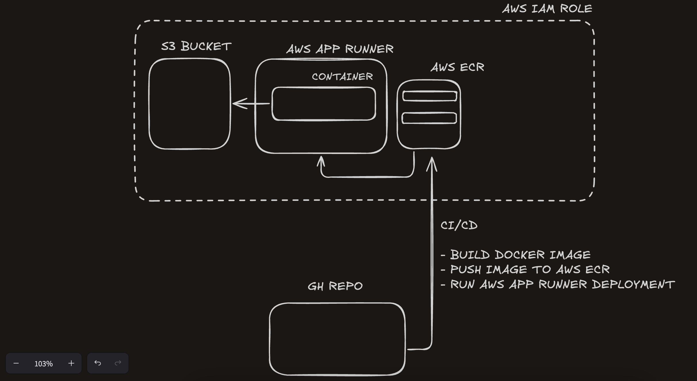

## Architecture



The project follows a clean, layered architecture:

```
├── main.py              # FastAPI application entry point
├── routes/              # API route definitions
│   └── weather.py      # Weather-related endpoints
├── services/            # Business logic layer
│   └── weather_service.py  # Core weather service
├── models.py            # Database models (SQLAlchemy)
├── schemas.py           # Pydantic data validation schemas
├── caching.py           # In-memory caching implementation
├── weather_client.py    # External weather API client
├── storage.py           # Database operations
├── s3_uploader.py      # S3/MinIO file upload service
├── utils.py             # Utility functions
└── deps.py              # Dependency injection setup
```

### Cache Implementation

The caching system is implemented in `caching.py` using the `cachetools` library:

```python
from cachetools import TTLCache

# key is (city, units)
cache = TTLCache(maxsize=256, ttl=300) # 5 minutes TTL
```

### Cache Strategy

1. **Cache Key**: Uses a tuple of `(city.lower(), units)` as the cache key
2. **TTL (Time To Live)**: 5 minutes (300 seconds) - weather data becomes stale after this time

## API Endpoints

### POST `/weather`
Get weather data for multiple cities with optional S3 upload.

**Query Parameters:**
- `upload=1`: Enable CSV upload to S3

**Request Body:**
```json
{
  "cities": ["London", "Paris", "New York"],
  "units": "metric"
}
```

**Response:**
```json
{
  "items": [
    {
      "city": "London",
      "temperature": 18.5,
      "humidity": 65,
      "wind_speed": 12.3,
      "description": "Partly cloudy",
      "clouds": 45,
      "pressure": 1013,
      "visibility": 10000,
      "sunrise": 1640995200,
      "sunset": 1641027600
    }
  ],
  "csv_url": "https://bucket.s3.amazonaws.com/reports/weather_metric.csv"
}
```

### POST `/weather/csv`
Get weather data in CSV format (no S3 upload).

### GET `/healthz`
Health check endpoint returning `{"status": "ok"}`.

### GET `/weather/logs`
Retrieve stored request logs filtered by date range.


### Environment Variables

| Variable | Default | Description |
|----------|---------|-------------|
| `DB_URL` | `sqlite:///./weather.db` | Database connection string |
| `S3_BUCKET` | `weather-reports` | S3 bucket name for CSV uploads |
| `AWS_REGION` | `us-east-1` | AWS region |
| `AWS_ENDPOINT_URL` | `None` | Custom S3 endpoint (for MinIO/localstack) |
| `S3_PUBLIC_URL_FMT` | `None` | Custom S3 public URL format |
